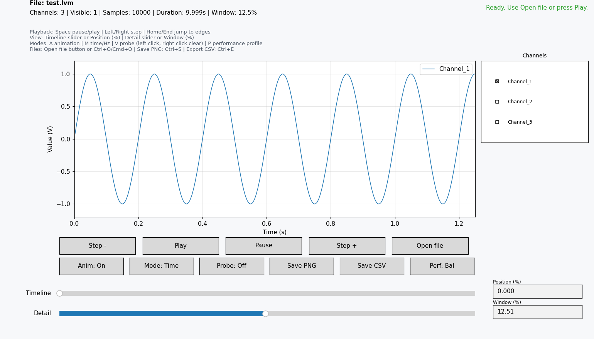
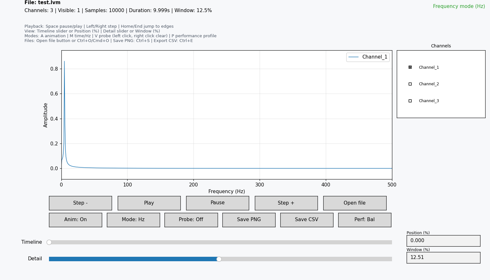
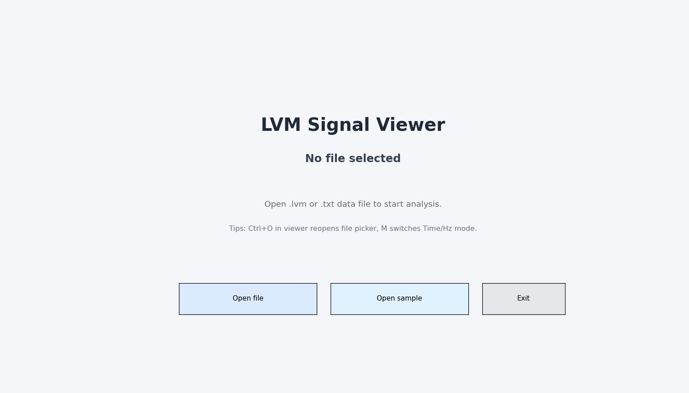

# LVM Signal Viewer

[Русская версия](README.ru.md)

[](https://github.com/almuleev/LVM-signal-viewer/actions/workflows/tests.yml)
[](https://github.com/almuleev/LVM-signal-viewer/releases/latest)
[](LICENSE)
[](https://www.python.org/)
[](#download)

Fast desktop viewer for LabVIEW measurements: open a file, inspect signals, and export results in seconds.



## Download

- Windows executable: [Latest Release](https://github.com/almuleev/LVM-signal-viewer/releases/latest)
- All release assets: [Releases](https://github.com/almuleev/LVM-signal-viewer/releases)
- Source install: clone this repository and run from Python.

## Screenshots

Frequency (Hz) mode with the FFT spectrum:



Empty start screen:



> Screenshots are rendered from the bundled sample with
> `python tools/capture_screenshots.py` — re-run it to refresh them after UI changes.

## Supported Formats

- `.lvm` (LabVIEW Measurement)
- `.txt` (tab-separated numeric text)

Not supported as input right now:
- `.csv`
- `.xlsx` / `.xls`

CSV export is supported for the currently visible data range.

## Key Features

- Empty-start mode with clear `Open file` entry point.
- Handles multi-header LVM files and non-monotonic sectioned time.
- Channel visibility panel with live legend updates.
- Timeline + zoom sliders with numeric `Position (%)` and `Window (%)` inputs.
- Time mode and FFT-based Hz mode.
- Point probe tool for exact values on visible traces.
- Performance profiles (`Fast`, `Balanced`, `Quality`) for weak/strong machines.
- Export current view as PNG.
- Export current visible data range as CSV.
- Local prepared-data cache for faster reopen.

## Quick Start

### Option A: Download and run (Windows)

1. Go to [Latest Release](https://github.com/almuleev/LVM-signal-viewer/releases/latest).
2. Download the Windows artifact.
3. Run `LVM_Signal_Viewer.exe`.

### Option B: Run from source

```bash
python -m venv .venv
```

Windows:

```bash
.venv\Scripts\activate
```

macOS/Linux:

```bash
source .venv/bin/activate
```

Install dependencies and start:

```bash
pip install -r requirements.txt
python lvm_viewer.py
```

Optional startup file:

```bash
python lvm_viewer.py path\to\file.lvm
```

## Controls

- Playback: `Space`, `Left/Right`, `Home/End`
- Zoom/detail: `Up/Down`, `Detail` slider, `Window (%)`
- Position: `Timeline` slider, `Position (%)`
- Modes: `A` for animation on/off, `M` for Time/Hz, `V` for Probe, `P` for performance profile
- File: `Open file` button or `Ctrl+O` / `Cmd+O`
- Export: `Save PNG` button or `Ctrl+S`; `Save CSV` button or `Ctrl+E`
- Probe: left click to place, right click or `Esc` to clear

## Limitations

- Desktop GUI app only (Tkinter + Matplotlib).
- Input parser expects tab-separated numeric columns with time in the first numeric column.
- Large files still need noticeable first parse before cache is created.
- FFT view is for quick inspection, not laboratory-grade spectral analysis.
- No Excel/CSV input parser yet.

## Roadmap

- Add optional CSV input support with delimiter detection.
- Add optional Excel input support after parser design and validation.
- Add more parser edge-case tests and UI smoke tests.
- Add signed Windows release pipeline.
- Add user guide screenshots/GIF in `docs/assets/`.

## Documentation

- Build and packaging: [docs/build.md](docs/build.md)
- Suggested GitHub topics: [docs/github-topics.md](docs/github-topics.md)
- Release process: [docs/release-checklist.md](docs/release-checklist.md)
- Promotion ideas: [docs/promotion.md](docs/promotion.md)

## Contributing

Contributions are welcome. Start with [CONTRIBUTING.md](CONTRIBUTING.md).

## License

MIT License. See [LICENSE](LICENSE).
